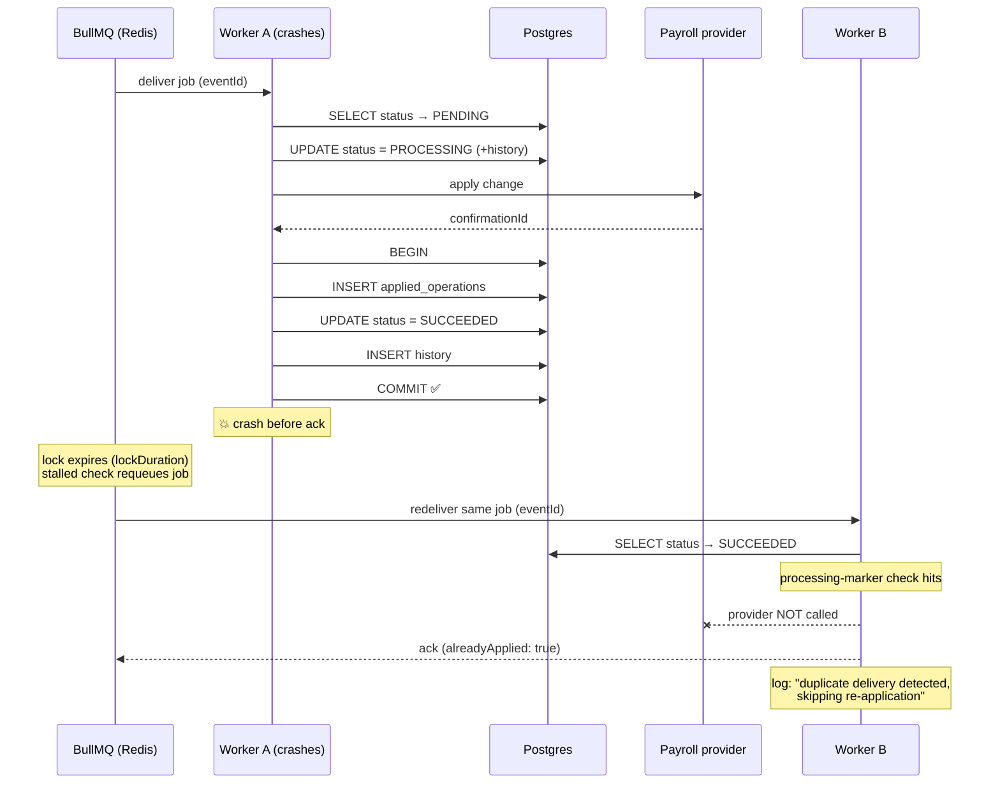

# Design Decisions

Running log of non-obvious choices and the reasoning behind them.
Database schema rationale lives in [database-design.md](./database-design.md).

---

## 1. Idempotency key: client header, falling back to a content hash

`POST /events` accepts an optional `Idempotency-Key` header. When absent, the key is
derived as:

```
derived:sha256(canonical_json({ employeeId, eventType, effectiveDate, payload }))
```

### Why content-hashing rather than a random server-side key

The whole point of the key is to survive a *retry*. A random key generated per request
is different on every attempt, so a client that times out and retries would create a
second event — the exact duplicate the mechanism exists to prevent. Only a value derived
from stable request content is identical across retries of the same logical submission.

### Why these four fields

They are the complete business identity of the change: *who* (`employeeId`), *what kind*
(`eventType`), *when it applies* (`effectiveDate`), and *the actual values* (`payload`).
Two requests agreeing on all four are the same instruction; any difference is a genuinely
different one.

Deliberately excluded: timestamps, request IDs, auth headers, and anything else that
varies between attempts at the same submission.

### Why the JSON is canonicalized

`JSON.stringify` preserves insertion order, so `{newSalary, currency}` and
`{currency, newSalary}` would hash differently despite being the same instruction. Keys
are sorted recursively before hashing, so serialization order cannot cause a spurious
duplicate. *(Covered by tests in both the unit and integration suites.)*

### Why the `derived:` prefix

It keeps server-derived keys distinguishable from client-supplied ones in the database.
When investigating a duplicate-submission incident, "did the client send a key or did we
compute one?" is the first question, and the prefix answers it without a join or a guess.

### The tradeoff being accepted

Content-hashing makes **identical resubmission** un-representable. A client that
deliberately wants to submit the same salary change twice (same employee, same date,
same amount) cannot do so without supplying its own distinct `Idempotency-Key`.

This is the correct default for payroll: an accidental double-submission is a
real-money incident, whereas a genuine duplicate is rare and has an explicit escape
hatch. Note the fallback only applies when the client sends **no** header — clients that
manage their own keys are unaffected.

### Why the key is a header, not a body field

It is transport-level retry metadata, not part of the payroll instruction. Keeping it in
the header means a retrying client reuses the value verbatim without reserializing the
body — and the body stays exactly what gets hashed.

---

## 2. Enqueue strictly after the transaction commits

`EventsService.submit` persists the event and its opening audit row in one transaction,
then enqueues the BullMQ job **after** that transaction commits.

### Why not enqueue inside the transaction

The worker is a separate process and frequently faster than the commit. Enqueueing
before commit creates two failure modes:

1. The worker picks up the job and queries for an event id **not yet visible** to its
   session — the row exists only inside our uncommitted transaction. It sees "not
   found" and fails a perfectly valid event.
2. The transaction **rolls back**. The job now points at a row that will never exist —
   a poison message referencing a phantom event.

### Why after-commit is the safe ordering

It inverts the failure mode into a recoverable one. If the enqueue fails, the event is
already durably `PENDING` in Postgres, and the worker's sweep for stale `PENDING` rows
picks it up. At-least-once delivery is recoverable; a job pointing at a non-existent row
is not.

This is the standard reliability tradeoff: prefer *duplicate work* (which
`applied_operations` already makes safe — see
[database-design.md](./database-design.md)) over *lost work*.

### Why a failed enqueue still returns 202

The event is committed, so the client's submission genuinely was accepted. Returning 500
would invite a retry that the idempotency key would collapse anyway, while falsely
telling the client their change was lost. The failure is logged at `error` level and the
row remains `PENDING` for the sweep. *(Covered by an integration test.)*

### Why the job carries only `{ eventId, employeeId }`

The worker re-reads the authoritative row from Postgres. Embedding a payload snapshot in
the job risks acting on stale data if the event changed after enqueue, and duplicates
the source of truth.

`employeeId` is the one exception: it is the partition key for per-employee ordering
(§8), and the ordering lock must be acquired *before* any database read — so it has to
travel on the job itself.

### Why `jobId = eventId`

Makes the enqueue itself idempotent. If the API crashes between commit and the queue
ack, a re-enqueue is collapsed by BullMQ rather than producing a second job.

---

## 3. Polymorphic validation without `@Type({ discriminator })`

Payload validation dispatches on `eventType` via a custom `ValidateBy` validator
(`IsValidPayloadForEventType`) rather than class-transformer's built-in discriminator.

### Why the built-in mechanism was rejected

It reads the discriminator from a property **inside** the nested object, whereas ours
lives on the parent envelope. Probed directly before committing to the design:

| Case | Result |
|---|---|
| Discriminator on parent only (our shape) | payload stays a plain `Object` — **all nested rules silently skipped** |
| Discriminator inside the payload | correctly instantiated |
| Unknown discriminator value | plain `Object` — **silently unvalidated** |

Both failing cases **fail open**: an invalid or unknown-typed payload passes validation
and reaches the service layer unchecked. On a payroll write path that is not an
acceptable default. The alternative — requiring clients to duplicate `eventType` inside
the payload — pushes an implementation detail into the public API.

The explicit validator dispatches from a single `PAYLOAD_DTO_BY_EVENT_TYPE` map, which
is also what the service uses, so the two cannot disagree.

### Why unknown fields are rejected rather than stripped

Both the global pipe (`forbidNonWhitelisted`) and the nested payload validation reject
unrecognised properties. A silently dropped field on a payroll change is worse than a
rejected request: the client believes a value was recorded when it was not. This also
means a payload carrying another event type's fields (e.g. `SALARY_CHANGE` with an
`iban`) is a 400 rather than a partially-applied change.

---

## 4. Status codes: 202 for new, 200 for duplicate

- **202 Accepted** — event persisted and queued; processing has not happened yet.
  `202` (not `201`) because the resource is not yet in its final state.
- **200 OK** — the idempotency key was already known. The existing event is returned and
  **no new job is enqueued**.
- **400 Bad Request** — validation failure, including unknown `eventType`.

### Why 400 rather than 422 for unknown `eventType`

The requirement allowed either. `400` is used consistently for *all* request-shape
problems, with the specific field failure in `details`:

```json
{
  "statusCode": 400,
  "error": "Bad Request",
  "message": "Validation failed",
  "details": ["eventType: eventType must be one of: BANK_ACCOUNT_CHANGE, ADDRESS_CHANGE, SALARY_CHANGE"]
}
```

An unknown `eventType` is not semantically different from any other invalid enum value,
so splitting it into a separate status would force clients to handle two codes for one
class of error. The `details` array is what a client actually needs to fix the request.

### Why the duplicate flag is in the body

Clients that care can distinguish `200` from `202` by status code, but `duplicate: true`
makes the outcome explicit in logs and test assertions without inspecting the status.

---

## 5. Monetary amounts as integer minor units

`SALARY_CHANGE.newSalary` is validated as a positive **integer in minor units** (cents),
not a float.

Binary floating point cannot represent most decimal amounts exactly (`0.1 + 0.2 !==
0.3`), and silent rounding in a payroll system is a real-money defect. Integer minor
units sidestep the problem entirely and match how payment providers model amounts.

Similarly, `iban` is validated with a real IBAN checksum rather than a loose string: a
malformed account number reaching the payroll provider is a failed or — worse —
misdirected payment, and the check is cheap at the API boundary.

---

## 6. Read endpoints: derived `failure` / `result` fields

`GET /events/:id` returns the full `history` timeline **and** two derived fields,
`failure` and `result`, holding the most recent failing and succeeding transitions.

The timeline alone would be sufficient — but every consumer (the frontend list, an
on-call engineer, a support tool) wants the same thing first: *what went wrong, most
recently*. Making each caller re-implement "reverse the array, find the first
`FAILED_*`" invites subtly different answers, and the obvious naive version — taking the
**first** failure — is wrong for an event that failed, retried, and failed again with a
different error.

Both fields are derived from the **latest** matching transition, and there is a test
seeding two distinct failures specifically to pin that ordering.

`lastError` on the event row is kept as well: it is the denormalised message for cheap
triage without joining history, whereas `failure.details` carries the full structured
context.

### List rows omit `payload`

`GET /events` returns `EventSummaryDto` without the payload; only the detail endpoint
includes it. Payloads are unbounded `jsonb`, and a 100-row page carrying full bank/address
details would be both slow and a needless exposure of PII in a view that only renders
status and dates.

### Pagination ordering

Rows are ordered `createdAt DESC, id DESC`. The `id` tiebreak matters: without it, two
events sharing a `created_at` have no deterministic order between queries, so the same
row can appear on two consecutive pages while another is skipped entirely.

---

## 7. OpenAPI: `@ApiResponse` over `@ApiCreatedResponse` for 202

`POST /events` returns **202** (new) or **200** (duplicate) and never 201.

`@ApiCreatedResponse({ status: 202 })` does **not** work — the decorator hardcodes 201
and ignores the override. This was caught by inspecting the generated document, which
showed `200, 201, 400` while the endpoint actually returns `200, 202, 400`. The fix is
the generic `@ApiResponse({ status: HttpStatus.ACCEPTED })`.

This is the failure mode that makes documentation-by-decorator risky: the wrong decorator
compiles cleanly, passes every endpoint test, and only manifests as documentation that
lies about the API. `test/swagger.e2e-spec.ts` therefore asserts the generated document
directly — that the documented status codes match reality, that no `$ref` is dangling,
and that the polymorphic `payload` renders as a `oneOf` over all three payload schemas.

The payload union needs `@ApiExtraModels` on the controller: those DTOs are reachable
only through the runtime discriminator, never as a directly-typed parameter, so Swagger's
type scanning cannot find them and their `$ref`s would otherwise dangle.

### Uniform error bodies

`ParseUUIDPipe` has its own error shape (`{message, error, statusCode}`, no `details`),
which differs from the global validation pipe's. It is given an `exceptionFactory` that
matches, so every 400 this API emits has one parseable shape.

---

## 8. Per-employee ordering: Redis sequence lock, not BullMQ Flows

**Requirement:** events for the same `employeeId` must process in acceptance order;
events for different employees must run concurrently.

**Chosen: strategy (a)** — one `payroll-events` queue, plus a per-employee FIFO list and
lock in Redis.

### Why not Flows (strategy b)

Flows are the wrong shape for this problem, in three compounding ways:

1. **The dependency direction is inverted.** BullMQ processes children *before* parents.
   Chaining B as a dependent of A therefore runs **B first** — the opposite of what is
   wanted. Getting A→B ordering requires making A the child of B, i.e. building the tree
   backwards from the newest event.

2. **A flow tree must be constructed knowing all its children.** Our events arrive one at
   a time over HTTP, with no way to know whether another event for that employee is
   seconds away. Appending to an existing tree means tearing it down and rebuilding it
   on every submission — not atomic against a worker already consuming it.

3. **Unbounded chain growth.** An employee submitting events all day accumulates an
   ever-deeper tree that is never fully retired, because the root cannot complete until
   every descendant has.

Flows are designed for fan-in/fan-out with a *known* child set (map-reduce, batch
completion). They are not a substitute for an open-ended, append-only ordered stream.

### How the sequence lock works

Two Redis structures per employee, both manipulated by Lua scripts so each
check-then-act is atomic:

| Key | Type | Purpose |
|---|---|---|
| `payroll:employee:<id>:queue` | list | FIFO of accepted event ids |
| `payroll:employee:<id>:lock` | string (TTL) | id of the event currently being processed |

- **Producer** appends the event id to the FIFO *before* adding the BullMQ job, so
  accepted order is durable even if the enqueue then fails.
- **Consumer** may only process an event when it is at the **head** of the FIFO and the
  lock is free. Otherwise the job is deferred.
- **On completion** (success *or* failure) the lock is released and the head popped in
  one atomic step, advancing the employee.

Atomicity is the whole point: two workers evaluating "is the lock free?" as separate
round trips would both see *yes* and both proceed. Every check-then-act therefore lives
inside a Lua script.

### Concurrency and ordering are decoupled

The worker runs `concurrency: 10`. Ordering does **not** come from limiting concurrency —
that would serialise *all* employees and destroy throughput. It comes from the lock,
which is scoped per employee. Ten different employees can be in flight simultaneously
while each one's events are strictly serialised.

### Deferral uses `moveToDelayed`, not re-`add`

A job whose turn has not come is deferred with `job.moveToDelayed()` followed by
throwing `DelayedError`.

The obvious alternative — re-`add`ing the job with the same `jobId` — is **silently
broken**. BullMQ refuses to re-add a `jobId` that is currently active or completed, and
it does so without error: `add()` returns a plausible-looking `Job` object while nothing
is actually queued, so the event vanishes. This was found by probing BullMQ directly
against a real Redis: the first event of each employee processed and everything after it
disappeared.

`moveToDelayed` is the right primitive because it:
- keeps the **same** job, so `jobId === eventId` still dedups redeliveries;
- does **not** consume a retry attempt (`DelayedError` signals a deliberate reschedule,
  not a failure), so waiting one's turn can never exhaust retries and land a valid event
  in the DLQ.

### Failure handling

The lock is released in a `finally`. Without that, one failing event would block every
later event for that employee until the TTL expired. There is a test asserting a failed
event does not wedge its employee's queue.

### Trade-offs accepted

- **Polling cost.** A waiting job re-checks every ~50 ms rather than being woken. This
  burns some Redis round trips under a deep per-employee backlog. Acceptable because the
  expected depth per employee is very small (an employee rarely has more than one or two
  in-flight payroll changes); a notification-driven wake-up is the optimisation if that
  ever stops being true.
- **Lock TTL vs. long jobs.** The lock has a 30 s TTL so a dead worker cannot block an
  employee forever. A legitimately long job would lose it, so the TTL is refreshed on an
  interval for the duration of the work.
- **A second source of truth.** Ordering state lives in Redis while events live in
  Postgres. If Redis is lost, ordering state is lost — surviving events are still
  `PENDING` in Postgres and recoverable, but their relative order within an employee
  would be rebuilt from `created_at` rather than the FIFO. That is the accepted cost of
  not putting a lock table in the hot path of every job.

---

## 9. Failure classification: `UnrecoverableError`, not `job.discard()`

Permanent failures stop retrying by throwing BullMQ's `UnrecoverableError`.

Both mechanisms work — verified against a real Redis that `UnrecoverableError` produces
exactly **1** attempt where a plain `Error` produces the full **3**. `UnrecoverableError`
is preferred because:

- **It propagates.** Business validation fails several frames deep inside
  `applyBusinessEffect`. An exception unwinds naturally; `discard()` would require
  threading the `job` object down to every site that might decide "permanent".
- **It keeps the decision in one place.** `discard()` *marks* the job then still needs a
  throw to end the attempt, so the intent lives in two statements that can drift apart.
  One throw carries both the outcome and the reason.
- **It reads correctly in the queue.** The job lands in `failed` with the real error
  message, which is what an operator inspecting the DLQ needs.

### The three-way outcome

| Situation | Event status | Retries |
|---|---|---|
| Business validation failed | `FAILED_PERMANENT` | none — `UnrecoverableError` |
| Provider returned a non-retryable error | `FAILED_PERMANENT` | none — `UnrecoverableError` |
| Retryable error, budget remains | stays `PROCESSING` | BullMQ retries with backoff |
| Retryable error, budget spent | `FAILED_TEMPORARY` | stopped, but re-triggerable |

**Why the row stays `PROCESSING` between retries.** Flapping it to `FAILED_TEMPORARY`
and back on every attempt would make the audit trail unreadable and break any "how many
events are currently failing?" dashboard — the count would spike and settle on every
transient blip. The attempt genuinely *is* still in flight. Each attempt still writes a
history row (with `willRetry: true`), so nothing is lost from the audit trail.

**Why `FAILED_TEMPORARY` is distinct from `FAILED_PERMANENT`.** It means "we gave up for
now", not "this can never work". It stays eligible for a manual re-trigger or a
scheduled sweep, which is why `completedAt` is deliberately left null for it and stamped
for `FAILED_PERMANENT`.

### Unknown errors are treated as retryable

An unrecognised exception is more likely transient infrastructure than permanently bad
data. The retry budget bounds the cost of guessing wrong; failing permanently on an
unknown error would silently discard recoverable payroll changes.

### Validation runs again in the worker

The API already validated the payload at submission, and the worker validates again
before the provider call. This is not redundant:

- events can sit queued for a long time, and the rules that matter are those in force
  when the change is *applied*;
- rows can be written by paths that never touch the DTO layer (backfills, migrations,
  manual repair);
- these are *business* rules (IBAN checksums, salary ceilings) rather than request-shape
  rules, and belong beside the code that acts on them.

The IBAN check is the real ISO 7064 MOD-97-10 algorithm, not a regex — verified against
valid IBANs from six countries (including 15-character Norwegian and alphanumeric
French/UK forms) and confirmed to reject single-digit corruptions that a shape check
would wave through. Salary carries a sanity ceiling because a value above it is far more
likely a unit error (major units sent as minor) than a real raise, and that mistake is
expensive to unwind.

### `attemptsMade` is 0-based during execution

Verified directly: a 3-attempt job observes `attemptsMade` as `0, 1, 2`. Logs and the
"is this the last attempt?" check therefore use `attemptsMade + 1`. An easy off-by-one
that would either mis-report attempt numbers or give up one retry early.

### Structured logs

Every lifecycle transition emits one JSON line carrying `eventId`, `employeeId`,
`eventType`, `attempt`, `maxAttempts`, and — on failures — `errorCode` and `willRetry`:

```json
{"timestamp":"...","level":"warn","event":"processing_failed_temporary",
 "eventId":"...","employeeId":"...","eventType":"SALARY_CHANGE",
 "attempt":2,"maxAttempts":3,"errorCode":"DOWNSTREAM_UNAVAILABLE","willRetry":true}
```

Written straight to stdout rather than through Nest's `Logger`, whose formatter would
wrap the JSON in ANSI colour codes and a prefix — making it unparseable by a log
aggregator.

---

## 10. Processing Consistency & Crash Recovery

### The scenario

> A worker receives an event, the payroll operation succeeds, DB changes are written, the
> worker crashes before the job is acknowledged to BullMQ, and the event is later
> redelivered.

This is not an edge case — it is the *normal* consequence of at-least-once delivery.
Any queue that guarantees "no lost messages" must sometimes deliver twice, because
acknowledging and doing the work cannot themselves be atomic across two systems.

The design goal is therefore **not** to prevent redelivery. It is to make redelivery
harmless: *at-least-once delivery, at-most-once effect*.

### The four failure windows

Reading left to right through one job, a crash can land in four places:

```
  [1]          [2]                  [3]                [4]
   |            |                    |                  |
   v            v                    v                  v
 claim  -->  call provider  -->  COMMIT(ledger +    -->  ack job
             (money moves)      SUCCEEDED + history)     to BullMQ
```

| Crash at | State left behind | Recovery |
|---|---|---|
| **[1]** before the provider call | `PROCESSING`, no ledger row | Redelivery re-runs from scratch. Safe: nothing happened. |
| **[2]** after the provider call, before commit | `PROCESSING`, no ledger row | Redelivery **re-calls the provider**. See "the honest gap" below. |
| **[3]** mid-commit | Nothing — the transaction rolls back | Same as [1]. |
| **[4]** after commit, before ack | `SUCCEEDED` + ledger row, job unacked | Redelivery short-circuits on the terminal status. **This is the scenario in the assignment.** |

### The mechanism

Three layers, each catching what the previous one misses:

**1. Processing-marker check (first line of defence).**
Before doing anything, the processor reads the event's current status. If it is already
`SUCCEEDED` or `FAILED_PERMANENT`, it returns immediately — no provider call, no status
write, no history row — and logs `duplicate delivery detected, skipping re-application`.
This runs *before* `markProcessing`, so a duplicate delivery does not even perturb the
row. It handles window **[4]**.

**2. `applied_operations` ledger (authoritative guard).**
Keyed `UNIQUE (event_id, operation_key)`. If the ledger row exists, the provider was
already called, so the stored result is replayed instead of re-calling. This catches the
nastier variant of [4] where the ledger committed but the status did not — the effect
already happened, so the redelivery only *finishes the transition the dead worker never
made*, preserving the original `confirmationId`.

**3. Single atomic commit.**
The ledger row, the `SUCCEEDED` status and the history entry are written in **one**
`$transaction`. This was previously split across two transactions, which left a real
window where the effect was recorded as applied but the event still read `PROCESSING`.
Now a crash either leaves all three absent (safe to retry from scratch) or all three
present (short-circuited by layer 1). There is no partial state.

### Sequence: crash after DB write, before ack



### BullMQ stalled-job configuration

| Setting | Value | Reasoning |
|---|---|---|
| `lockDuration` | 30s | Must exceed the slowest realistic job. The provider takes up to 3s and a job may also wait on its employee ordering lock. Too low and healthy long-running jobs get redelivered *while still executing* — two workers on one event. |
| `stalledInterval` | 15s | Detection latency. A crashed job is reclaimed within roughly `lockDuration + stalledInterval` (~45s worst case). |
| `maxStalledCount` | 2 | Caps how many times a job may stall before being failed. Without it, a poison message that reliably kills its worker cycles forever, taking a worker down each time. |

Verified against a real Redis: worker A takes a job and is hard-killed, worker B is
handed the *same* job and completes it. Critically, **`attemptsMade` stays 0 across a
stall** — a stall is not a failed attempt and does not consume the retry budget. That
means BullMQ offers no protection against re-running the effect; the idempotency layers
above are the only thing standing between a crash and a double payment.

### The recovery sweep

BullMQ's stalled detection covers the common case, but it is blind to three situations
where Postgres holds the truth and Redis does not:

- the job exhausted `maxStalledCount` and was dropped;
- Redis lost data (restart without persistence, failover, eviction) so the job no longer
  exists;
- the API committed the event but crashed before enqueueing it.

The sweep finds events in `PROCESSING` whose `startedProcessingAt` is older than a
configurable timeout (default 5 min), and **re-enqueues** them.

**Why re-enqueue rather than mark `FAILED_TEMPORARY`.** A stuck event is evidence of a
dead *worker*, not a bad *event*. The event may be perfectly valid and simply unlucky in
which process picked it up. Marking it `FAILED_TEMPORARY` pushes a recoverable event
into a state needing human attention — at any scale, that means an on-call queue full of
events whose only fault was a rolling deploy.

Re-enqueueing is safe *precisely because of* the idempotency guarantees above. Without
them, re-enqueueing would risk double payment and `FAILED_TEMPORARY` would be the only
responsible choice. This is a good example of how one guarantee unlocks a better
operational posture elsewhere.

The exception is the pathological case: an event that repeatedly kills its worker would
be re-enqueued forever. After `MAX_RECOVERY_ATTEMPTS` (10) it is parked in
`FAILED_TEMPORARY` — still re-triggerable by an operator, but no longer cycling.

The sweep also **releases the dead worker's employee ordering lock**. Without that, the
re-enqueued job would defer forever waiting on a lock held by a process that no longer
exists. (The lock has a TTL, but the sweep should not have to wait for it.)

It runs **in-process** on an interval, plus once at startup. Scheduling it as a queued
job would be self-defeating: its whole purpose is recovering from a queue that may be
empty or lost. It is idempotent and cheap, so several replicas running it concurrently
is harmless — the row update serialises them.

### The honest gap: window [2]

If the worker crashes **after** the provider call but **before** the commit, the ledger
row was never written, so a redelivery *will* call the provider again.

This is unavoidable with a non-transactional external system: the provider call and the
database commit cannot be made atomic without distributed transactions or provider-side
idempotency. The mitigation in a real integration is to send our `eventId` as the
provider's own idempotency key, pushing the dedup one hop downstream. The simulated
gateway does not model that, so the gap is documented rather than hidden.

Window [2] is also the narrowest: it spans the few milliseconds between the provider
returning and the local commit, whereas window [4] spans the entire ack round trip.

### What the tests prove

- Redelivery of a `SUCCEEDED` event → provider called **0** additional times.
- Ten sequential redeliveries → **1** provider call, **1** ledger row, **2** history rows
  (the audit trail is byte-identical to a single clean run — no phantom entries).
- Ledger row present but status `PROCESSING` (the crash-after-ledger case) → provider
  **not** called, transition completed, **original** `confirmationId` preserved.
- Transaction failure → **0** ledger rows, i.e. no partial state.
- Real stalled-job recovery: worker A killed mid-job, worker B completes it, effect
  applied exactly once.
- Sweep re-enqueues stuck events, ignores fresh and terminal ones, parks poison events,
  releases orphaned locks, and is safe to run repeatedly.

---

## 11. Observability: health, logging, error shape

### `GET /health` — custom, not Terminus

A lightweight implementation was chosen over `@nestjs/terminus`. Terminus is a good fit
when its bundled indicators cover your dependencies, but the queue check here needs to
reach into the *existing* `BullEventQueue` provider — the same connection the producer
uses. Wrapping that in a Terminus indicator adds an adapter layer and a dependency to
express roughly the same thing the service already does in ~40 lines. Terminus also has
no BullMQ indicator, so that half would be custom regardless.

**Redis and BullMQ are probed separately.** A `PING` proves the server is up; it does
*not* prove the queue is usable — a wrong database index, evicted keys, or a Lua script
that will not load all leave Redis answering PING while BullMQ is broken. The queue
probe therefore asks for job counts, exercising the path the producer actually uses.
There is a test pinning the "Redis up, queue down" case.

**Every dependency is critical**, so any failure yields 503. Without Postgres the API
cannot accept events; without Redis accepted events are never processed. Reporting 200
while either is down would let a load balancer keep routing traffic into a service that
silently drops work.

**Probes run concurrently with a 3s timeout.** Serial probes would take the sum of the
timeouts, and a health endpoint slower than the load balancer's own timeout is worse than
useless — the probe is killed and the instance looks dead anyway. There is a test that
asserts the endpoint answers in under 6s even when a probe never settles.

**An unconfigured queue reports down, not up.** A deploy missing `REDIS_URL` is broken;
health must say so rather than showing green while events pile up unprocessed.

The 200 and 503 bodies are identical in shape, because an operator debugging a 503 needs
the same breakdown as one confirming a 200.

### Worker health: HTTP, not a heartbeat file

The worker has no HTTP surface of its own, so a heartbeat file (touch a file each loop,
probe its mtime) is the cheaper option. HTTP was chosen anyway:

- **It matches how the worker is run.** Compose `healthcheck` and Kubernetes
  `livenessProbe` speak HTTP natively. A file check needs `exec` into the container —
  slower, needs a shell in the image, and reports less.
- **A heartbeat proves the wrong thing.** It says the process loop is alive. It cannot
  say Postgres is reachable or the BullMQ consumer is still connected — a worker looping
  happily while unable to reach its database is exactly the failure an operator needs to
  see, and a heartbeat reports it green.
- **Files lie across restarts.** A stale file outlives the process that wrote it; a probe
  reading a recent-enough mtime declares health while nothing is running. Fixing that
  needs PID-liveness logic that HTTP gets for free — if nothing is listening, the probe
  fails.

The cost is one listening socket serving a single route. Both services now have compose
healthchecks wired to their endpoints.

The worker's check includes `isWorkerRunning()`, because a process whose BullMQ consumer
has closed is still a live process — and would otherwise report healthy while doing no
work at all.

### Structured logging in `@payroll/shared`

One `StructuredLogger` implementation, used by both services, emitting:

```json
{"timestamp":"…","level":"info","service":"payroll-api","context":"EventsService",
 "event":"processing_succeeded","eventId":"…","employeeId":"…","message":"…"}
```

It lives in `@payroll/shared` rather than being implemented twice so that **one query
works across the whole pipeline**. `eventId` correlates every line about a payroll event
from HTTP submission through to worker completion — which is the point of structured
logging here, and is lost the moment the two services drift on field names.

Output goes straight to stdout, not through Nest's `Logger`, whose formatter wraps
records in ANSI colour codes and a prefix that make the JSON unparseable. Nest's *own*
framework output is redirected through a `LoggerService` adapter for the same reason:
otherwise a single process emits two formats, and the framework half — carrying the
startup failures worth alerting on — is the unparseable one.

`packages/shared` deliberately carries no `@types/node`, so `console` and `process` are
reached via `globalThis`. Adding the types would let Node-only APIs leak into a package
the frontend may eventually import.

### Global exception filter

Every failure returns one shape:

```json
{"statusCode":404,"error":"Not Found","message":"Event abc not found",
 "timestamp":"…","path":"/events/abc"}
```

**Stack traces are logged, never returned.** The original message of an unhandled error
is withheld too — it can carry connection strings, SQL fragments, or payload data. The
response says `"An unexpected error occurred"` while the log keeps the full stack. There
is a test asserting a thrown error containing a credentials-shaped connection string
appears in the log and *not* in the response body.

Deliberate `HttpException`s keep their message (they were written for the caller), and a
validation body's `details` array is preserved rather than flattened.

4xx logs at `warn`, 5xx at `error` — only 5xx is our fault and worth alerting on.

---

## 12. Enum parity between Prisma and the shared package

Prisma generates its enums as string-literal unions; `@payroll/shared` exports real
TypeScript enums. The values are identical but the types are not mutually assignable, so
`EventsService` converts at the persistence boundary and the Prisma types stay out of
the public API.

Because that conversion is a cast, TypeScript cannot verify it. `enum-parity.spec.ts`
asserts both enums hold exactly the same values, so adding a value to `schema.prisma`
without mirroring it in `packages/shared` fails a test rather than surfacing as a runtime
bug on the write path.
